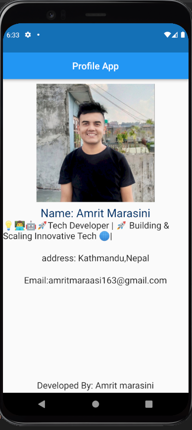

# myapp

A new Flutter project.
# My Profile App



My Profile App is a Flutter-based mobile application that allows users to create and showcase their personal profiles in a stylish and customizable way.

## Features

- **User Profiles:** Create and customize your personal profile with details such as name, profile picture, bio, and social media links.

- **Customization:** Choose from a variety of themes, fonts, and layout options to make your profile unique.

- **Social Media Integration:** Add links to your social media profiles, making it easy for others to connect with you.

- **Gallery:** Share your favorite photos and moments in a gallery section.

- **Contact:** Provide contact information for users who want to get in touch with you.

## Getting Started

### Prerequisites

- Flutter installed on your development machine. If you haven't already, you can get it from [here](https://flutter.dev/docs/get-started/install).

### Installation

1. Clone this repository:

   ```sh
   git clone https://github.com/yourusername/my-profile-app.git
   cd my-profile-ap

## Getting Started

This project is a starting point for a Flutter application.
Usage
Launch the app on your device or emulator.

Create your personal profile by providing your details and customizing the appearance.

Share your profile with friends and colleagues.

Explore the different customization options and make your profile uniquely yours.
A few resources to get you started if this is your first Flutter project:

- [Lab: Write your first Flutter app](https://docs.flutter.dev/get-started/codelab)
- [Cookbook: Useful Flutter samples](https://docs.flutter.dev/cookbook)

For help getting started with Flutter development, view the
[online documentation](https://docs.flutter.dev/), which offers tutorials,
samples, guidance on mobile development, and a full API reference.
